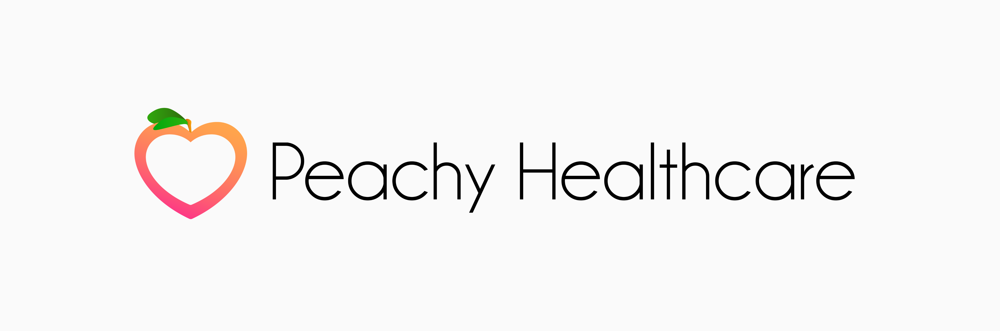

# Peachy healthcare Dashboard by Dansteve Adekanbi (22178806)

<!-- add image -->


## Author

* Name: Dansteve Adegbola Adekanbi
* Student ID: 22178806
* Course Title: CMP7200 - Individual Master's Project
* Course Code: CMP7200
* University: Birmingham City University
* Module Leader: Dr Iain Rice

## Project Title
Design and Implementation of an AI-Powered Precision Medicine Dashboard

## Project Overview

* This project is a simple Design and Implementation of an AI-Powered Precision Medicine Dashboard application (peachy-healthcare).
The primary aim of this project is to design and implement an AI-powered precision medicine dashboard that integrates genetic test results from saliva-based pharmacodynamic tests, medication metabolism information, and lifestyle data to provide personalized health insights and recommendations

* This is a prove of concept for my Individual Master's Project A S2 2022/3 course work.

* The project is built using the following technologies:

    1. [Ionic - Angular](https://ionicframework.com/docs/) (HTML, SCSS, TypeScript/JavaScript)
    2. [NestJS - NodeJS](https://docs.nestjs.com/) (TypeScript/JavaScript)
    3. Python (Flask) (Python)

## Project Enviroment Requirements

* [NodeJS](https://nodejs.org/en/) (v14.17.0)
* [NPM](https://www.npmjs.com/) (v6.14.13)
* [Ionic](https://ionicframework.com/docs/) (v6.16.3)
* [NestJS](https://docs.nestjs.com/) (v8.0.0)
* [Python](https://www.python.org/) (v3.9.5)

# Database

we are using postgresql database and the database is hosted on [neon](https://console.neon.tech/)

## Project Setup

1. Clone the repository

    ```bash
    git clone https://github.com/Dansteve/peachy-healthcare.git
    ```

2. Install the dependencies for the backend and frontend

    ```bash
    cd peachy-healthcare
    npm install
    ```

3. Run the backend and frontend

    ```bash
     npm run serve
     ```

4. Visit the frontend in your browser

    ```bash
    http://localhost:4200
    ```

5. Visit External the frontend in your browser

    ```bash
    TBD
    ```

## Disclaimer

* :fire: Note: This project is not production ready. It is only a prove of concept. so no security measures have been put in place and the database is not persistent.

## Deployment

* The project is deployed on Firebase. You can visit the deployed version of the project [here](https://peachy-healthcare-53901.web.app/public/login)
